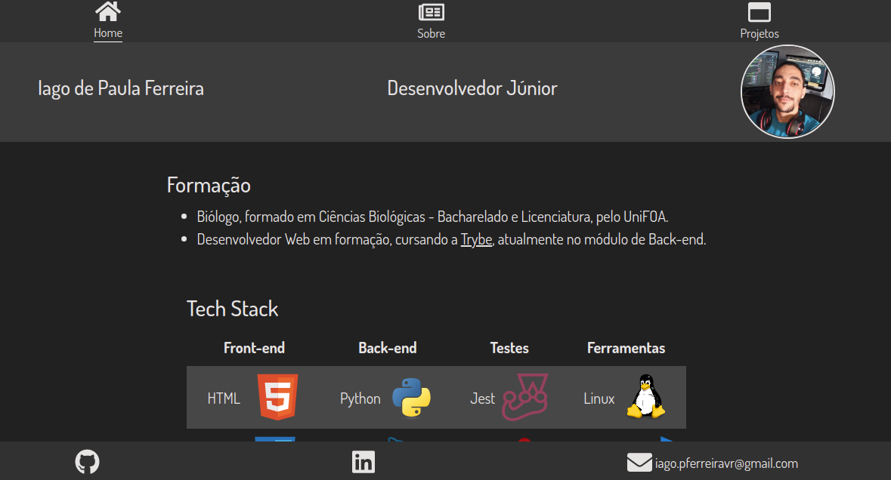

# Boas vindas ao repositório do meu portfolio em React

Esse projeto foi desenvolvido para exibir meus conhecimentos em desenvolvimento web, assim construi esse site e muitos outros projetos que estão na sessão `Projetos` do portfólio

---

<!-- ## Preview do projeto

 -->

---

## Instalação do projeto localmente

Após cada um dos passos, haverá um exemplo do comando a ser digitado para fazer o que está sendo pedido, caso tenha dificuldades e o exemplo não seja suficiente, não hesite em me contatar em *iago.pferreiravr@gmail.com*.

Passo 1. Abra o terminal e crie um duretório no local de sua preferência com o comando `mkdir`:

~~~bash
mkdir projetos-iago
~~~

Passo 2. Entre no diretório que você acabou de criar:

~~~bash
cd projetos-iago
~~~

Passo 3. Clone o projeto:

~~~bash
git clone git@github.com:IagoPFerreira/portfolio-react.git
~~~

Passo 4. Após terminado a clonagem, entre no diretório que você acabou de clonar:

~~~bash
cd portfolio-react
~~~

Passo 5. Instale todas as dependências do projeto:

~~~bash
npm install
~~~

Passo 6. Após a instalação das dependências, rode a aplicação

~~~bash
npm start
~~~

A aplicação será aberta no seu navegador automaticamente, e ela deve se parecer com essa:

---

## Link para o deploy

<https://iagopferreira.github.io/portfolio-react>
